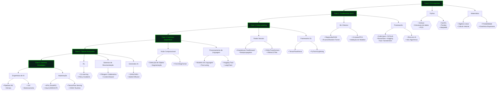

# Hello!

# About ...


# Diagramas de Aprendizagem

### Visualização Geral Resumo:



```mermaid
graph TD
    A[Fase 0: Pré-requisitos] --> B[Fase 1: Fundamentos de IA]
    B --> C[Fase 2: Deep Learning]
    C --> D[Fase 3: Domínios Específicos]
    D --> E[Fase 4: Tópicos Avançados]
    E --> F[Fase 5: Domínio Estratégico]

    classDef matrixStyle fill:#082117,stroke:#00FF00,color:#00FF00,stroke-width:2px;
    class A,B,C,D,E,F matrixStyle;

    A --> A1[Python]
    A --> A2[Matemática]
    A1 --> A11{{"• Sintaxe<br>• Estruturas de dados<br>• POO"}}
    A1 --> A12{{"• NumPy<br>• Pandas<br>• Matplotlib"}}
    A2 --> A21{{"• Álgebra Linear<br>• Cálculo Vetorial"}}
    A2 --> A22{{"• Probabilidade<br>• Estatística Bayesiana"}}

    B --> B1[ML Clássico]
    B --> B2[Frameworks]
    B1 --> B11{{"• Regressão/SVM<br>• Árvores/Random Forest"}}
    B1 --> B12{{"• K-means/PCA<br>• Validação de Modelos"}}
    B2 --> B21{{"• Scikit-learn • PyTorch •TensorFlow • Hugging  Face Transformers"}}
    B2 --> B22{{"• Ética em IA<br>• Viés Algorítmico"}}

    C --> C1[Redes Neurais]
    C --> C2[Frameworks DL]
    C1 --> C11{{"• Arquiteturas Feedforward<br>• Backpropagation"}}
    C1 --> C12{{"• CNNs/Transformers<br>• RNNs/LSTMs"}}
    C2 --> C21{{"• TensorFlow/Keras"}}
    C2 --> C22{{"• PyTorch/Lightning"}}

    D --> D1[Visão Computacional]
    D --> D2[Processamento de Linguagem]
    D1 --> D11{{"• Detecção de Objetos<br>• Segmentação"}}
    D1 --> D12{{"• YOLO/SegFormer"}}
    D2 --> D21{{"• Modelos de Linguagem<br>• Fine-tuning"}}
    D2 --> D22{{"• Hugging Face<br>• LangChain"}}

    E --> E1[RL]
    E --> E2[Sistemas de Recomendação]
    E --> E3[Generative AI]
    E1 --> E11{{"• Q-Learning<br>• Policy Gradients"}}
    E2 --> E21{{"• Filtragem Colaborativa<br>• Content-Based"}}
    E3 --> E31{{"• GANs/VAEs<br>• Stable Diffusion"}}

    F --> F1[Engenharia de IA]
    F --> F2[Implantação]
    F1 --> F11{{"• Pipelines ML<br>• MLOps"}}
    F1 --> F12{{"• XAI<br>• Monitoramento"}}
    F2 --> F21{{"• APIs (FastAPI)<br>• Cloud (AWS/GCP)"}}
    F2 --> F22{{"• TensorFlow Serving<br>• ONNX Runtime"}}


```
---
# PHΔSΞ - Diagrams:


### "PHΔSΞ ZΞRO" Diagram: 

```markdown
# INSERIR Diagrama Mermaid

```


